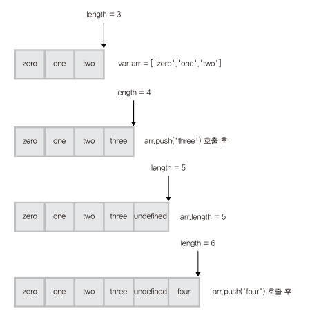

# 자바스크립트 데이터 타입과 연산자
데이터 타입은 기본타입과 참조타입으로 나뉜다.

|기본타입|참조타입|
|---|---|
|숫자 문자열 ...| 객체|

## 1. 자바스크립트 기본 타입
자바스크립트는 __느슨한 타입 체크 언어__ 이다. 

변수를 선언할때는 _var_ 라는 키워드로 모든 타입을 선언한다.

### 1.1. 숫자
자바스크립트는 _int_, _double_, _float_ 등의 숫자타입이 아닌 _number_ (64bit 부동 소수점 형태)라는 숫자타입 하나가 존재한다. 

이는 __/__ 연산에서 주의해야한다. C언어에서는 5/2 = 2라면 JS는 2.5가 된다.

### 1.2. 문자열
자바스크립트에서 문자열은 ' 와 " 로 생성한다. _char_ 라는 데이터타입은 존재하지 않고 모두 _string_ 타입으로 취급된다.

> 한번 정의된 문자열은 변하지 않는다.

    var str = "test";
    str[0] = 'T';
    console.log(str); // (출력값)test

### 1.3. 불린값
ture값과 false값을 가지는 불린 타입이 있다.

### 1.4. null과 undefined
두 타입 모두 __'값이 비어있음'__ 을 뜻한다. 값이 할당되지 않은 변수는 undefined 타입이며 undefined타입의 변수는 값 또한 undefined이다. 

__undefined는 타입이자 값을 나타낸다.__

그에반해 null타입 변수는 개발자가 명시적으로 값이 비어있음을 나타내는데 사용한다. 그러나 null타입 변수의 타입은 object라는 것을 주의해야한다.
    
    var nullVar = null;
    console.log(typeof nullVar === null); // (출력값) false
    console.log(nullVar === null); // (출력값) true

## 2. 자바스크립트 참조 타입(객체 타입)
자바스크립트에서 기본 타입을 제외한 모든 값은 객체이다. 따라서 배열, 함수, 정규표현식 등 모두 객체로 표현된다.

자바스크립트에서 객체는 'key:value'를 저장하는 컨테이너이다.
 
기본타입은 하나의 값만을 가지는데 객체는 여러개의 프로퍼티를 포함할 수 있고 그 프로퍼티는 기본 타입이거나 참조 타입일 수 있다.
 
이러한 성질로 객체의 프로퍼티는 함수도 포함할 수 있으며 자바스크립트에서 이러한 함수를 메소드라고한다.

### 2.1. 객체 생성
객체를 생성하는건 크게 세 가지 방식이 있다.
* Object() 생성자 함수 이용
* 객체 리터럴 방식 이용
* 생성자 함수 이용

#### 2.1.1. Object() 생성자 함수 이용
자바스크립트는 Object()라는 내장 생성자 함수를 제공한다.

    var foo = new Object();
    foo.name = 'foo';
    foo.age = 25;
    foo.gender = 'male';

    console.log(typeof foo); //(출력값) object
    console.log(foo); // (출력값) { name: 'foo', age: 25, gender: 'male' }

#### 2.1.2. 객체 리터럴 방식 이용
객체 리터럴 방식은 간단한 표기로 객체를 생성하는 방법을 말한다. _2.1.1._ 에서 표현한 객체를 객체 리터럴 방식으로 다시표현하면 아래와 같다.

    var foo = {
        name: 'foo',
        age: 25,
        gender: 'male'
    }

#### 2.1.3. 생성자 함수 이용
Function()이라는 내장 생성자 함수로 선언한다.(4장에서 다룸)

### 2.2. 객체 프로퍼티 읽기/쓰기/갱신
객체의 프로퍼티에 접근하는 방법은 두 가지가 있다.
* 대괄호 표기법
* 마침표 표기법

#### 2.2.1. 대괄호 표기법
    console.log(foo['name']); // (출력값) foo
> 주의 : foo['name']대신에 foo[name]으로 표기하면 undefined가 출력된다.
#### 2.2.2. 마침표 표기법
    console.log(foo.name); // (출력값) foo

#### 2.2.3. 대괄호 표기법만 사용해야 하는 경우
접근하려는 프로퍼티가 표현식 또는 예약어일 경우 대괄호 표기법만을 이용해 접근해야 한다.

    foo['full-name'] = 'foo bar'; // full-name이라는 프로퍼티 생성
    console.log(foo.full-name); // NaN 값 출력

> NaN(Not a Number) 값
 
수치 연산을 해서 정상적인 값을 얻지 못할 때 출력되는 값이다.
 
1 - 'hello' 연산의 값은 NaN이다.

### 2.3. for in 문과 객체 프로퍼티 출력
for in 문으로 객체의 모든 프로퍼티에 대한 루프를 수행할 수 있다.

for in 문 예제 :

    var prop;
    for(prop in foo){
        console.log(prop, foo[prop]);
    }
---
[출력 결과]

    name foo
    age 25
    gender male

### 2.4. 객체 프로퍼티 삭제
delete 연산자로 프로퍼티를 삭제할 수 있다. 단 delete 연산자는 객체를 삭제하지 못한다.

    delete(foo.name); // true
    console.log(foo); // (출력값) {age: 25, gender: 'male'}

    delete foo.age;
    console.log(foo); (출력값) {gender: 'male'}

## 3. 참조 타입의 특성
객체의 모든 연산은 참조 값으로 처리된다.

    var objA = {
        val : 40
    }
    var objB = objA;

    console.log(objA+" "+objB); // (출력값) 40 40
    
    objA.val = 30;
    console.log(objA+" "+objB); // (출력값) 30 30

### 3.1. 객체 비교
동등연산자 (==)를 사용할 때도 참조값을 비교한다.

    var objA = { val : 10 };
    var objB = { val : 10 };
    var objC = objB;

    console.log(objA==objB); // (출력값) false
    console.log(objB==objC); // (출력값) true

### 3.2. 참조에 의한 함수 호출 방식
* 객체 타입 : call-by-value
* 참조 타입 : call-by-reference

## 4. 프로토타입
자바스크립트의 __모든 객체는 자신의 부모 역할을 하는 객체와 연결되어 있다.__ 이것은 객체지향언어의 상속의 개념과 같이 부모의 프로퍼티를 자신의 것 처럼 사용할 수 있는 특징이 있다. 자바스크립트에서는 이러한 부모 객체를 __프로토타입 객체__ (__프로토타입__) 이라고 부른다.

    console.dir(foo);
---
[출력결과]

    Object
        __proto__:
            constructor: ƒ Object()
            hasOwnProperty: ƒ hasOwnProperty()
            isPrototypeOf: ƒ isPrototypeOf()
            propertyIsEnumerable: ƒ propertyIsEnumerable()
            toLocaleString: ƒ toLocaleString()
            toString: ƒ toString()
            valueOf: ƒ valueOf()
            __defineGetter__: ƒ __defineGetter__()
            __defineSetter__: ƒ __defineSetter__()
            __lookupGetter__: ƒ __lookupGetter__()
            __lookupSetter__: ƒ __lookupSetter__()
            get __proto__: ƒ __proto__()
            set __proto__: ƒ __proto__()

foo객체에 \_\_proto\_\_ 프로퍼티가 있는 것을 확인 할 수 있다. 이 프로퍼티가 foo객체의 부모인 __프로토 타입 객체__ 이다.
> ECMAScript 에서는 크롬 브라우저의 \_\_proto\_\_프로퍼티를 [[Prototype]]으로 명시한다.

\_\_proto\_\_프로퍼티가 가리키는 객체는 Object.prototype이고 이 객체는 toString(), valueOf()등의 내장 메소드를 포함한다.  
(리터럴방식으로 생성된 객체의 경우 Object.prototype 객체가 프로토타입 객체가 된다.)

객체를 생성할 때 결정된 프로토타입 객체는 임의의 다른 객체로 변경하는 것이 가능하다(부모의 객체를 바꾸는 것이 가능. 자바스크립트는 이것으로 상속을 구현한다).

## 5. 배열
자바스크립트에서 배열은 특별한 형태의 객체이다. 어느위치에 어느타입의 데이터를 저장해도 문제가 없다.

### 5.1. 배열 리터럴
새로운 배열을 만드는데 사용하는 표기법이다. 대괄호를 사용하여 표현한다.

    var colorArr = ['orrange', 'blue', 'green', 'red'];

객체 리터럴은 key: value의 페어를 모두 표함해야하지만 배열리터럴은 각 요소의 값만을 포함한다.

### 5.2. 배열의 요소 생성
자바스크립트의 배열의 경우 값을 순차적으로 넣을 필요없이 아무 위치에나 값을 추가할 수 있다.

    var emptyArr = [];
    console.log(emptyArr[0]); // (출력값) undefined
    
    emptyArr[0] = 100;
    emptyArr[3] = 'eight';
    emptyArr[5] = true;
    console.log(emptyArr);
    // (출력값) [100, undefined, undefined, "eight", undefined, true]
    console.log(emptyArr.lenght); // (출력값) 6

### 5.3. 배열의 lenght 프로퍼티
모든 배열은 lenght프로퍼티를 가진다. __lenght 프로퍼티는 배열 내 가장 큰 인텍스에 1을 더한 값이다.__ 

    var arr = [];
    arr[0] = 0;
    arr[1] = 1;
    arr[4] = 4;
    console.log(arr.lenght); // (출력값) 5
---
    arr.lenght = 7;
    console.log(arr);
    // (출력값) [0, 1, undefined, undefined, 4, undefined, undefined]
---
    arr.lenght = 2;
    console.log(arr) // (출력값) [0, 1]
> lenght 프로퍼티의 범위를 벗어나는 실제 값은 삭제된다.

#### 5.3.1. 배열의 표준 메소드와 lenght 프로퍼티
자바스크립트의 배열에서는 __lenght 프로퍼티를 기반__ 으로 하는 다양한 표준 메소드가 있다.
 
예를 들어 push() 함수의 경우
 
;

### 5.4. 배열과 객체
자바스크립트에서는 배열도 객체이다.
