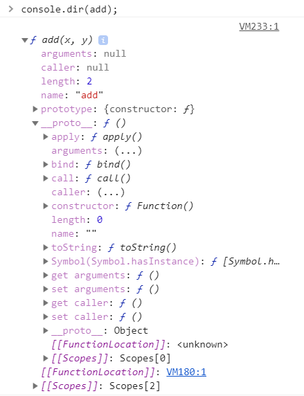
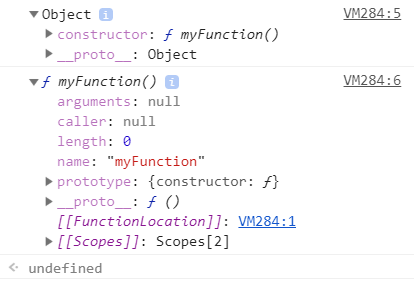
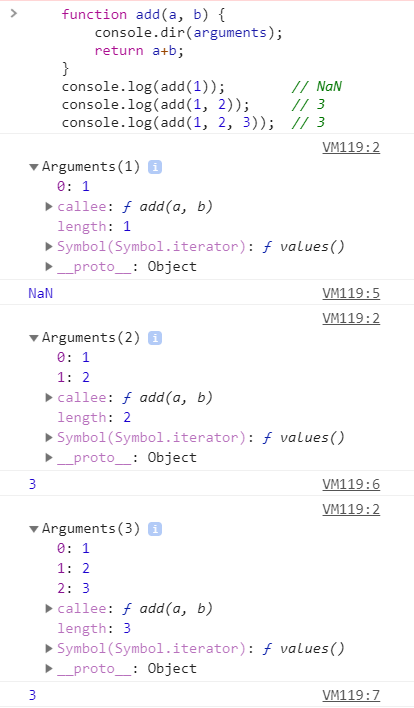
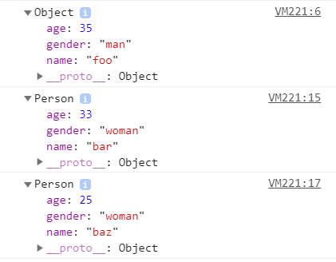
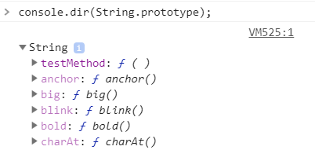

# 함수와 프로토타입 체이닝

이번 장에서 알아볼 내용
1. 함수 생성
2. 함수 객체
3. 다양한 함수 형태
4. 함수 호출과 this
5. 프로토타입과 프로토타입 체이닝

## 1. 함수 정의
함수를 선언하는 세 가지 방식
* 함수 선언문
* 함수 표현식
* _Function()_ 생성자 함수

### 1.1. 함수 리터럴
자바스크립트는 함수도 객체이다. 객체 리터럴 방식으로 객체를 생성할 수 있는 것처럼 함수도 __함수 리터럴__ 을 이용해 함수를 생성할 수 있다. 함수 선언문, 함수 표현식 모두 이러한 리터럴 방식으로 함수를 생성한다. 

    function add(x, y){
        return x+y;
    }

함수 리터럴은 크게 네 가지로 구분된다.

1. _function_ 키워드 : 자바스크립트 함수 리터럴은 function 키워드로 시작한다.
2. 함수 명 : 함수를 구분하는 식별자로서 사용된다. 필요사항이 아닌 선택사항이다.
3. 매개변수 : 타입을 기술하지 않는다는 특징이 있다.
4. 함수 몸체 : 실제 함수가 호출됐을 때 실행되는 코드이다.

### 1.2. 함수 선언문 방식으로 함수 생성하기
함수 선언문 방식은 함수 리터럴과 형태가 같다. 차이점은 __반드시 함수명이 정의되어 있어야 한다__.

### 1.3. 함수 표현식 방식으로 함수 생성하기
자바스크립트에서는 함수도 하나의 값처럼 취급된다(일급 객체). 따라서 함수도 숫자나 문자열처럼 변수에 할당하는 것이 가능하다.
 
이러한 방식으로 리터럴로 하나의 함수를 만들고 함수를 변수에 할당하여 함수를 생성하는 것을 __함수 표현식__ 이라고 한다.

    var add = function (x, y) {
        return x + y;
    }

    var plus = add;

여기서 add 변수는 리터럴로 생성한 함수를 참조하는 변수이지 함수 이름이 아니다. 이렇게 함수가 할당된 변수를 __함수 변수__ 라고 부른다.
> 함수 이름이 표함된 함수 표현식을 __기명함수 표현식__ 이라 한다. 기명 함수 표현식을 사용할 때는 주의해야할 점이 있는데 함수 표현식에서 사용 된 함수 이름을 외부코드에서 접근할 수 없다는 점이 있다.
 
보통 재귀호출을 사용할 때 기명 함수 표현식을 사용한다.

### 1.4. Function() 생성자 함수를 통한 함수 생성하기
자바스크립트의 함수는 ___Function()___ 이라는 기본 내장 생성자 함수로부터 생성된 객체라고 볼 수 있다. 함수 선언문, 함수 표현식도 리터럴로 함수를 생성하지만 내부적으로는 _Function()_ 생성자 함수를 통해 생성된다고 볼 수 있다.
    
    var add = new Function('x', 'y', 'return x+y');

### 1.5. 함수 호이스팅
함수를 생성하는 3가지 방법으로 모두 같은 기능을 하는 함수를 생성했는데 이들은 동작방식이 약간 다르다. 그중 하나가 __함수 호이스팅(Function Hoisting)이다.

    add(2, 3); // 5

    function add(x, y) {
        return x+y;
    }

    add(3, 4); // 7

함수 선언문형태로 정의한 함수의 유효범위는 코드의 맨 처음부터 시작한다. 이러한 함수 호이스팅은 함수를 사용하기 전에 선언해야한다는 규칙을 무시하므로 코드의 구조를 엉성하게 만들 수 있기 때문에 함수 표현식 사용을 권장한다.

    add(2, 3); // uncaught type error

    var add = function (x, y) {
        return x+y;
    }

    add(3, 4); // 7
    
이러한 함수 호이스팅이 발생하는 원인은 자바스크립트의 변수 생성(Instantiation)과 초기화(Initialization)과 관련이 있다(5장에서 설명).

## 2. 함수 객체 : 함수도 객체다

### 2.1. 자바스크립트에서는 함수도 객체다.

    function add(x, y){
        return x+y;
    }
    //add()함수 객체에 result, status프로퍼티 추가
    add.result = add(3,2);
    add.status = "OK";

    console.log(add.result) // (출력값) 5
    console.log(add.status) // (출력값) OK

add()함수를 생성할 때 함수 코드는 [[Code]] 내부 프로퍼티에 자동으로 저장된다.

### 2.2. 자바스크립트에서 함수는 값으로 취급된다
자바스크립트에서 함수는 객체이다. 그렇기 때문에 다음과 같은 동작이 가능하다.

* 리터럴에 의해 생성
* 변수나 배열의 요소, 객체의 프로퍼티 등에 할당 가능
* 함수의 인자로 전달 가능
* 함수의 리턴값으로 리턴 가능
* 동적으로 프로퍼티를 생성 및 할당 가능

이와 같은 특징으로 자바스크립트는 함수를 __일급(First Class) 객체__ 라고 부른다. 여기서 일급 객체는 앞에나온 기능을 모두 수행가능한 객체를 일급 객체라고 한다. 
> 1. 모든 요소는 함수의 실제 매개변수가 될 수 있다.
> 2. 모든 요소는 함수의 반환 값이 될 수 있다.
> 3. 모든 요소는 할당 명령문의 대상이 될 수 있다.
> 4. 모든 요소는 동일 비교의 대상이 될 수 있다.

출처 : 위키피디아

#### 2.2.1 변수나 프로퍼티의 값으로 할당
함수는 숫자나 문자열처럼 프로퍼티의 값으로 할당될 수 있다.

    var bar = function(){return 100;}
    console.log(bar()); // (출력값) 100

    var obj = {};
    obj.baz = bar;
    console.log(obj.baz()); // (출력값) 100

함수는 첫 번째 경우처럼 변수에만 할당할 수 있는 것이아닌 baz처럼 객체의 프로퍼티나 배열의 원소 등에도 할당이 가능하다.

#### 2.2.2. 함수 인자로 전달
함수는 다른함수의 인자로도 전달이 가능하다.

    var foo = function(func) {
        func();
    };

    foo(function(){
        console.log('asdf');
    }); // (출력값) asdf

#### 2.2.3. 리턴값으로 활용

    var foo = function(){
        return function(){
            console.log('fdsa');
        };
    };

    var bar = foo();
    bar(); // (출력값) fdsa

### 2.3. 함수 객체의 기본 프로퍼티
함수는 일반적인 객체와 다르게 추가로 __함수 객체만의 표준 프로퍼티__ 가 정의되어 있다.

ECMA5 스크립트 명세서에는 모든 함수가 length와 prototype프로퍼티를 가져야 한다고 기술한다.
우선 _name_, _caller_, _arguments_, \_\_proto\_\_프로퍼티를 살펴보자. 이들은 ECMA표준이 아니다.
 
* _name_ : 함수의 이름을 나타낸다.
* _caller_ : 자신을 호출한 함수를 나타낸다.
* _arguments_ : 함수를 호출할 때 전달된 인자값을 나타낸다.
> __arguments 객체__
>  ECMA표준에서는 arguments 프로퍼티와 이름이 같은 arguments객체를 정의하고 있다. arguments객체는 함수를 호출할 때 호출된 함수의 내부로 인자값과 함께 전달되며, arguments 프로퍼티와 유사하게 함수를 호출할 때 전달 인자값의 정보를 제공해 준다.

* _\_\_proto\_\__ : 함수 객체의 부모역할을 하는 객체를 가리킨다. ECMA표준에서는 함수 객체의 부모 역할을 하는 프로토타입 객체를 Function.prototype 객체라고 명명하고 이것 역시 __함수 객체__ 라고 정의한다.
> 크롬 브라우저는 Function Prototype 객체를 ___Empty() 함수___ 라고 명하고 있다. _Empty()_ 함수가 가지는 프로퍼티와 메소드를 살펴보면 Function.prototype객체가 가지는 프로퍼티, 메소드를 가지는 것을 알 수 있다.
>* _constructor_ 프로퍼티
>* _toString()_ 메소드
>* _apply(thisArg, argArray)_ 메소드
>* _call(thisArg, [, arg1 [,arg2,]])_ 메소드
>* _bind(thisArg, [, arg1 [,arg2,]])_ 메소드
---
> Function.prototype객체의 프로토타입 객체는 Object.prototype객체이다.

#### 2.3.1. length 프로퍼티
length프로퍼티는 ECMAScript에서 정한 모든 함수가 가져야 하는 표준 프로퍼티로서, 함수가 실행될 때 기대되는 인자의 개수를 나타낸다.

    function func0(){    };
    function func1(x){    };

    console.log(func0.length); // (출력값) 0
    console.log(func1.length); // (출력값) 1

#### 2.3.2. prototype 프로퍼티
모든 함수는 객체로서 prototype 프로퍼티를 가지고 있다. 이것은 객체의 부모를 나타내는 내부 프로퍼티인 [[Prorotype]]과 혼동하지 말아야 한다.

> prototype 프로퍼티와 [[Prototype]] 프로퍼티
> 두 프로퍼티 모두 프로토 타입객체를 가리킨다는 공토점이 있지만 관점에 차이가 있다. [[Prototype]]은 객체입장에서 자신의 부모 역할을 하는 프로토타입 객체를 가리키는 반면, prototype 프로퍼티는 이 함수가 생성자로 사용될 때 이 함수를 통해 생성된 객체의 부모역할을 하는 프로토타입 객체를 가리킨다.

prototype 프로퍼티는 함수가 생성될 때 만들어지며, 단지 ___constructor_ 프로퍼티__ 하나만 있는 객체를 가리킨다. 그리고 prototype 프로퍼티가 가리키는 프로토타입 객체의 유일한 constructor 프로퍼티는 자신과 연결된 함수를 가리킨다. 
 
즉 자바스크립트는 함수를 생성할 때 함수 자신과 연결된 프로토타입 객체를 동시에 생성하며 이 둘은 다음 그림처럼 각각 prototype과 constructor라는 프로퍼티로 서로를 참조하게 된다.

    function myFunction(){
        return true;
    };

    console.dir(myFunction.prototype);
    console.dir(myFunction.prototype.constructor);

* _myFunction.prototype_ 객체는 ___constructor___ 와 ___\_\_proto\_\____ 라는 두 개의 프로퍼티가 있다. 이 객체는 _myFunction()_ 함수의 프로토타입 객체이므로 _constructor_ 프로퍼티가 있다. 또한 프로토타입 객체 역시 자바스크립트 객체이므로 자신의 부모 역할을 하는 prototype프로퍼티가 있다. 
* _myFunction.prototype.constructor_ 의 값을 출력함으로써 프로토타입 객체와 매핑된 함수를 알아볼 수 있다. 결과값을 보면 _myFunction()_ 함수를 가리키고 있다.

이렇듯 함수 객체와 프로토타입 객체는 서로 밀접하게 연결되어 있다.

## 3. 함수의 다양한 형태

### 3.1. 콜백 함수
자바스크립트 함수이름은 꼭 붙이지 않아도 되는 선택사항이다. 함수이름을 붙이지 않은 함수를 __익명 함수__ 라고 하는데 익명 함수의 대표적 활용이 __콜백 함수__ 이다. 콜백 함수는 코드를 통해 명시적으로 호출하는 함수가 아닌, 함수를 등록하기만 하고 특정 시점에 도달했을 때 시스템에서 호출되는 함수를 말한다. 또한 특정 함수의 인자로 넘겨서 코드 내부에서 호출되는 함수 또한 콜백 함수가 될 수 있다.
> 콜백함수의 대표적 예
>  자바스크립트의 이벤트 핸들러. 웹페이지 로드 혹은 키보드가 입력되는 등의 DOM이벤트가 발생할 경우 브라우저는 정의된 DOM이벤트에 해당하는 이벤트 핸들러를 실행시킨다.

### 3.2. 즉시 실행 함수
함수를 정의함과 동시에 바로 실행하는 함수를 __즉시 실행 함수(immediate function)__ 라고 한다. 

    (function (name){
        console.log('This is --> '+name);
    })('foo');
    // This is --> foo

최초 한번만 실행을 필요로 하는 초기화 코드 부분 등에서 사용한다.

    (function( window, undefined){
        ...
    })(window);

이렇게 jQuery에서 직시 실행 함수를 사용하는 이유는 자바스크립트의 변수 유효 범위 특성 때문이다. 자바스크립트는 __함수 유효 범위__ 를 지원한다. 함수 내부에서 정의된 매개변수와 변수는 함수 코드 내부에서만 유효하다. 따라서 이렇게 라이브러리 코드를 즉시 실행 함수 내부에 정의해 두게되면, 라이브러리 내의 변수들은 함수 외부에서 접근할 수 없다. 이렇게 함으로써 전역 네임스페이스를 더럽히지 않음으로 다른 라이브러리를 로드해도 변수간 충돌을 방지할 수 있다.
> var, let, const의 차이점 
>1. __var__(function-scoped) : 변수의 유효범위가 함수단위이다. 재선언이 가능하다.
>2. __let, const__(blocked-scoped) : 변수의 유효범위가 블록단위이다. 재선언이 불가능하며 const의 경우 재할당도 불가능하다.

### 3.3. 내부 함수
자바스크립트는 함수 코드 내부에서도 다시 함수 정의가 가능하다. 내부 함수는 클로저 생성, 록립적인 헬퍼 함수 구현 등의 용도로 사용된다.

    //parent()
    function parent(){
        var a = 100;
        var b = 200;

        function child(){
            var b = 300;

            console.log(a);
            console.log(b);
        }
        child();
    }
    parent();
    child();

    // (출력값)
    100
    300
    Uncaught Re ... not defined

__스코프 체이닝__ 으로 인해 이 것이 가능하다. 자세한 내용은 5장에서 배우고 여기서는 __내부 함수는 자신을 둘러싼 외부 함수의 변수에 접근 가능하다__ 는 정도를 알면 된다. 반대로 내부 함수를 리턴하는 형태로 부모 함수 밖에서도 내부 함수를 호출하는 것이 가능하다.

    function parent(){
        var a = 100;
        var child = function(){
            console.log(a);
        }

        return child;
    }

    var inner = parent();
    inner();
    // (출력값) 100

이와 같이 실행이 끝난 _parent()_ 와 같은 부모 함수 스코프의 변수를 참조하는 _inner()_ 와 같은 함수를 __클로저__ 라고 한다.

### 3.4. 함수를 리턴하는 함수
자바스크립트에서는 함수도 일급 객체이므로 함수 자체를 리턴하는 것이 가능하다.

다음은 자신을 재정의 하는 함수이다.

    var self = function () {
        console.log('a');
        return function () {
            console.log('b');
        }
    }

    self = self();  // a
    self();         // b

## 4. 함수 호출과 this

### 4.1. arguments 객체
C같은 언어와 달리 자바스크립트는 함수 형식에 맞추어 인자를 넣지 않아도 에러가 발생하지 않는다.

    function func (arg1, arg2){
        console.log(arg1, arg2);
    }
    func();         // (출력값) undefined undefined
    func(1);        // (출력값) 1 undefined
    func(1, 2);     // (출력값) 1 2
    func(1, 2, 3);  // (출력값) 1 2

이러한 자바스크립트의 특성 때문에 런타임 시에 호출된 인자의 개수를 확인하고 이에 따라 동작을 다르게 해줘야 할 경우가 있다. 이를 가능케 하는 게 바로 ___arguments__ 객체_ 이다. 자바스크립트에서는 함수를 호출할 때 자동으로 arguments 객체가 함수 내부로 전달되기 때문이다. arguments 객체는 함수를 호출할 때 넘긴 인자들이 배열 형태로 저장된 객체를 의미하는데 이 객체는 실제 배열이 아닌 유사 배열 객체이다.

    function add(a, b) {
        console.dir(arguments);
        return a+b;
    }
    console.log(add(1));        // NaN
    console.log(add(1, 2));     // 3
    console.log(add(1, 2, 3));  // 3

arguments객체는 세 가지로 구성되어 있다.

* 넘겨진 인자 : 첫 번째 인자는 0번 인덱스, 두 번째 인자는 1번 인덱스...
* lenght 프로퍼티 : 호출할 때 넘겨진 인자의 개수를 의미한다.
* callee 프로퍼티 : 현재 실행중인 함수의 참조값(여기서는 add())

arguments객체는 매개변수 개수가 정확하게 정해지지 않은 함수를 구현하거나, 전달된 인자의 개수에 따라 서로 다른 처리를 해줘야 하는 함수를 개발하는 데 유용하게 사용할 수 있다.
    function sum () {
        var result = 0;

        for(var i = 0; i < arguments.length; i++){
            result += arguments[i];
        }

        return result;
    }

### 4.2. 호출 패턴과 this 바인딩

#### 4.2.1. 객체의 메소드 호출할 때 this 바인딩
객체의 프로퍼티가 함수인 경우 메소드라고 한다. 메소드를 호출할 대 메소드 내부 코드에서 사용된 this는 __해당 메소드를 호출한 객체로 바인딩__ 된다.

    var myObject = {
        name : 'foo',
        sayName : function (){
            console.log(this.name);
        }
    };
    var otherObject = {
        name : 'bar'
    };

    otherObject.sayName = myObject.sayName;

    myObject.sayName();     // foo
    otherObject.sayName();  // bar

#### 4.2.2. 함수를 호출할 때 this 바인딩

자바스크립트는 함수를 호출하면, 해당 함수 내부 코드에서 사용된 this는 전역 객체에 바인딩 된다.

> 전역객체 
> 모든 객체는 전역 객체의 프로퍼티이다.

이런 this바인딩의 특성은 내부 함수를 호출했을 경우에도 그대로 적용되므로, 내부 함수에서 this를 이용할 때는 주의해야 한다.

    var value = 100;
    var myObj = {
        value: 1,
        func1 : function () {
            this.value += 1;
            console.log(this.value);

            func2 = function () {
                this.value += 1;
                console.log(this.value);
            }
            func2();
        }
    }
    // (출력값)
    2
    101

이와 같은 현상은 내부 함수 호출 패턴을 정의해 놓지 않아서 생기는데 이를 해결하기 위해 __부모 함수의 _this___ 를 내부함수가 접근 가능한 __다른 변수에 저장__ 하는 방법이 사용된다. 이 변수의 이름은 관례상 that이라고 한다.

    var value = 100;
    var myObj = {
        value: 1,
        func1 : function(){
            var that = this;
            this.value++;
            console.log(this.value);

            func2 = function () {
                that.value += 1;
                console.log(that.value);
            }
            func2();
        }
    }
    // (출력값)
    2
    3

#### 4.2.3. 생성자 함수를 호출할 때 this 바인딩
형식이 크게 정해져 있지 않고 기존 함수에 ___new___ 키워드를 붙여서 호출하면 생성자함수로 동작한다.
(생성자 함수로 정의하는 함수는 함수의 첫 문자를 대문자로 쓰는 것을 권장한다)

__생성자 함수가 동작하는 방식__ 
1. 빈 객체 생성 및 this 바인딩
  생성자 코드가 실행되기 전 빈 객체가 생성된다. 이 객체가 생성자 함수가 새로 생성하는 객체이며 this로 바인딩 된다. 
2. this를 통한 프로퍼티 생성

3. 생성된 객체 리턴
  특별한 리턴문이 없을 경우 this로 바인딩 된 새로 생성한 객체가 리턴된다(명시적으로 this를 리턴해도 결과가 같음). 리턴값이 this 객체(새로 생성한 객체)와 같지 않으면 그 해당 객체가 리턴된다.

객체 리터럴 방식과 생성자 함수를 통한 객체 생성 방식의 차이 

    var foo = {
        name : 'foo',
        age : 35,
        gender : 'man'
    }
    console.dir(foo);

    function Person(name, age, gender, position){
        this.name = name;
        this.age = age;
        this.gender = gender;
    }

    var bar = new Person('bar', 33, 'woman');
    console.dir(bar);
    var baz = new Person('baz', 25, 'woman');
    console.dir(baz);
    

차이점은 [[Prototype]]에 있다. 객체 리터럴 방식의 경우 프로토 타입의 객체가 Object(Object.prototype)이고 생성자함수는 Person(Person.prototype)이다.

생성자 함수를 _new_ 키워드를 붙이지 않고 호출하는 경우.
자바스크립트에서는 생성자 함수와 일반 함수의 차이가 없기 때문에 생성자 목적으로 정의한 함수에 new 를 붙이지 않는다거나 그 반대의 경우 오류가 생길 수 있다(this의 바인딩 방식때문).

    var qux = Person('qux', 20, 'man');
    console.log(qux); // undefined

    console.log(window.name) // qux

#### 4.2.4. call과 apply 메소드를 이용한 명시적인 this 바인딩
자바스크립트는 내부적인 this바인딩 이외에도 특정객체에 this를 명시적으로 바인딩 시키는 방법도 제공한다.
_apply()_ 와 _call()_ 메소드는 모든 함수의 부모 객체인 Function.prototype 객체의 메소드 이므로 모든 함수는 다음과 같은 형식으로 메소드를 호출 할 수 있다.

    Function.apply(thisArg, argArray);

_apply()_ 메소드를 호출하는 주체는 함수이고 _apply()_ 메소드도 _this_ 를 특정 객체에 바인딩을 할 뿐 기능은 함수 호출이다. 예를 들어 Person.apply()이렇게 호출하면 기본적인 기능은 Person의 함수를 호출하는 것이다.

___apply()메소드___ 에서 _thisArg_ 는 apply()메소드를 호출한 함수 내부에서 사용한 this와 바인딩할 객체를 가리킨다(첫 번째 인자와 this가 바인딩 됨). _argArray_ 인자는 함수를 호출할 때 넘긴 인자들의 배열을 가리킨다. _apply()_ 메소드도 결국 함수호출이기때문에 매개변수가 있는 함수를 호출하기 위해서는 인자를 줘야하는데 두 번째 인자인 _argArray_ 로 받는다.

call()과 apply()메소드는 함수의 기능이 같다. 이 두 함수의 장점은 this를 원하는 값으로 명시적으로 매핑해서 특정 함수나 메소드를 호출 할 수 있다는 점 이다. 바로  arguments 객체같이 유사 배열 객체에서 배열 메소드를 사용하는 경우 arguments 객체는 실제 배열이 아니기 때문에 pop() 이나 shift() 같은 표준 배열 메소드를 사용할 수 없는데 apply()를 이용하여 Array.prototype.pop.apply(arguments);
이런 식으로 배열 처럼 사용할 수 있다.

### 4.3. 함수 리턴
자바스크립트 함수는 항상 리턴값을 반환한다. 
1. 일반 함수, 메소드는 리턴값을 지정하지 않을 경우 undefined가 리턴된다.

2. 생성자 함수에서 리턴값을 지정하지 않을 경우 생성된 객체가 리턴된다. 
단 명시적으로 리턴값을 주었을 때 리턴값이 객체인 경우 명시된 값이 리턴된다.

## 5. 프로토타입 체이닝

### 5.1. 프로토타입의 두 가지 의미
자바스크립트는 C++, JAVA와는 다른 __프로토타입 기반의 객체지향 프로그래밍__ 을 지원한다.

자바스크립트의 모든 객체는 자신의 부모인 프로토타입 객체를 가리키는 참조 링크 형태의 프로퍼티가 있다. 이 링크는 __암묵적 프로토타입 링크(implicit prototype link)__ 라 부르며 이러한 링크는 모든 객체의 \[\[Prototype\]\] 프로퍼티에 저장된다.
>prototype 프로퍼티와 \[\[Prototype\]\]링크의 차이점 
자바스크립트에서 모든 객체는 자신을 생성한 생성자 함수의 prototype 프로퍼티가 가리키는 프로토타입 객체를 자신의 부모 객체로 설정하는 \[\[Prototype\]\]링크로 연결한다.

### 5.2. 객체 리터럴 방식으로 생성된 객체의 프로토타입 체이닝
자바스크립트에서 객체는 자기 자신의 프로퍼티뿐 아니라 자신의 부모역할을 하는 프로토타입 객체의 프로퍼티또한 자신의 프로퍼티인마냥 접근하는 것이 가능하다. 이것을 프로토타입 체이닝이라고 한다 __(상속개념)__.

### 5.3. 생성자 함수로 생성된 객체의 프로토타입 체이닝
자바스크립트에서 모든 객체는 자신을 생성한 생성자 함수의 prototype 프로퍼티가 가르키는 객체를 자신의 프로토타입 객체로 취급한다.

    function Person(name, age, hobby){
        this.name = name;
        this.age = age;
        this.hobby = hobby;
    }

    var foo = new Person('foo', 30, 'tennis');

    console.dir(Person.prototype);

생성자 함수와 객체리터럴의 차이를 사실 잘 모르겠슴니당...;;

### 5.4. 프로토 타입 체이닝의 종점
Object.prototype객체는 프로토타입 체이닝의 종점이다. 이 말은 모든 객체는 Object.prototype객체가 가진 모든 프로퍼티와 메소드를 접근 가능하고 공유할 수 있다는 말이다.

### 5.5. 기본 데이터 타입 확장
모든 객체에서 호출가능한 메소드, 프로퍼티가 Object.prototype에 있다면 숫자, 문자열, 배열 등은 이들의 프로토타입인 Number.prototype, String.prototype, Array.prototype등으로 정의되어있다. 물론 이 프로토타입들도 Object.prototype을 자신의 프로토 타입으로 가지고 있는다.

자바스크립트는 Object.prototype, String.prototype등과 같은 표준 프로토타입 객체에서도 사용자가 직접 정의한 메소드를 추가하는 것을 허용한다.

    String.prototype.testMethod = function ( ) {
        console.log('test');
    }

    var str = 'sf';
    str.testMethod(); // test

표준 메소드가 생겼다.

### 5.6. 프로토타입도 자바스크립트 객체다
함수가 생성될 때 자신의 prototype 프로퍼티에 연결되는 프로토타입 객체는 디폴트로 constructor 프로퍼티만을 가진 객체다. 당연히 프로토타입 객체 역시 자바스크립트 객체이므로 일반 객체처럼 __동적으로 프로퍼티의 추가/삭제가 가능하다__.

### 5.7. 프로토타입 메소드와 this 바인딩
프로토타입 객체는 메소드를 가질 수 있다(이를 프로토타입 메소드라고 한다).

프로토타입 메소드 내부에서 사용한 this 바인딩은 일반 객체와 똑같이 메소드 this 바인딩 처럼 취급된다(메소드를 호출한 객체에 바인딩 된다).

### 5.8. 디폴트 프로토타입은 다른 객체로 변경이 가능하다.
함수를 생성할 때 해당 함수와 연결되는 디폴트 프로토타입 객체를 다른 일반 객체로 변경하는 것이 가능하다. 이러한 특징을 이용하여 객체지향의 상속을 구현한다.

단 생성자 함수의 프로토타입이 변경되면 변경된 시점 이후에 생성된 객체들은 변경된 프로토 타입 객체로 \[\[Prototype\]\]링크를 연결한다.