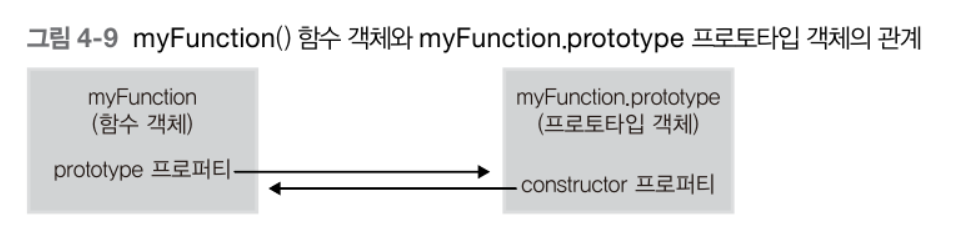

# 함수와 프로토타입 체이닝

이번 장에서 알아볼 내용
1. 함수 생성
2. 함수 객체
3. 다양한 함수 형태
4. 함수 호출과 this
5. 프로토타입과 프로토타입 체이닝

## 1. 함수 정의
함수를 선언하는 세 가지 방식
* 함수 선언문
* 함수 표현식
* _Function()_ 생성자 함수

### 1.1. 함수 리터럴
자바스크립트는 함수도 객체이다. 객체 리터럴 방식으로 객체를 생성할 수 있는 것처럼 함수도 __함수 리터럴__ 을 이용해 함수를 생성할 수 있다. 함수 선언문, 함수 표현식 모두 이러한 리터럴 방식으로 함수를 생성한다. 

    function add(x, y){
        return x+y;
    }

함수 리터럴은 크게 네 가지로 구분된다.

1. _function_ 키워드 : 자바스크립트 함수 리터럴은 function 키워드로 시작한다.
2. 함수 명 : 함수를 구분하는 식별자로서 사용된다. 필요사항이 아닌 선택사항이다.
3. 매개변수 : 타입을 기술하지 않는다는 특징이 있다.
4. 함수 몸체 : 실제 함수가 호출됐을 때 실행되는 코드이다.

### 1.2. 함수 선언문 방식으로 함수 생성하기
함수 선언문 방식은 함수 리터럴과 형태가 같다. 차이점은 __반드시 함수명이 정의되어 있어야 한다__.

### 1.3. 함수 표현식 방식으로 함수 생성하기
자바스크립트에서는 함수도 하나의 값처럼 취급된다(일급 객체). 따라서 함수도 숫자나 문자열처럼 변수에 할당하는 것이 가능하다.
 
이러한 방식으로 리터럴로 하나의 함수를 만들고 함수를 변수에 할당하여 함수를 생성하는 것을 __함수 표현식__ 이라고 한다.

    var add = function (x, y) {
        return x + y;
    }

    var plus = add;

여기서 add 변수는 리터럴로 생성한 함수를 참조하는 변수이지 함수 이름이 아니다. 이렇게 함수가 할당된 변수를 __함수 변수__ 라고 부른다.
> 함수 이름이 표함된 함수 표현식을 __기명함수 표현식__ 이라 한다. 기명 함수 표현식을 사용할 때는 주의해야할 점이 있는데 함수 표현식에서 사용 된 함수 이름을 외부코드에서 접근할 수 없다는 점이 있다.
 
보통 재귀호출을 사용할 때 기명 함수 표현식을 사용한다.

### 1.4. Function() 생성자 함수를 통한 함수 생성하기
자바스크립트의 함수는 ___Function()___ 이라는 기본 내장 생성자 함수로부터 생성된 객체라고 볼 수 있다. 함수 선언문, 함수 표현식도 리터럴로 함수를 생성하지만 내부적으로는 _Function()_ 생성자 함수를 통해 생성된다고 볼 수 있다.
    
    var add = new Function('x', 'y', 'return x+y');

### 1.5. 함수 호이스팅
함수를 생성하는 3가지 방법으로 모두 같은 기능을 하는 함수를 생성했는데 이들은 동작방식이 약간 다르다. 그중 하나가 __함수 호이스팅(Function Hoisting)이다.

    add(2, 3); // 5

    function add(x, y) {
        return x+y;
    }

    add(3, 4); // 7

함수 선언문형태로 정의한 함수의 유효범위는 코드의 맨 처음부터 시작한다. 이러한 함수 호이스팅은 함수를 사용하기 전에 선언해야한다는 규칙을 무시하므로 코드의 구조를 엉성하게 만들 수 있기 때문에 함수 표현식 사용을 권장한다.

    add(2, 3); // uncaught type error

    var add = function (x, y) {
        return x+y;
    }

    add(3, 4); // 7
    
이러한 함수 호이스팅이 발생하는 원인은 자바스크립트의 변수 생성(Instantiation)과 초기화(Initialization)과 관련이 있다(5장에서 설명).

## 2. 함수 객체 : 함수도 객체다

### 2.1. 자바스크립트에서는 함수도 객체다.

    function add(x, y){
        return x+y;
    }
    //add()함수 객체에 result, status프로퍼티 추가
    add.result = add(3,2);
    add.status = "OK";

    console.log(add.result) // (출력값) 5
    console.log(add.status) // (출력값) OK

add()함수를 생성할 때 함수 코드는 [[Code]] 내부 프로퍼티에 자동으로 저장된다.

### 2.2. 자바스크립트에서 함수는 값으로 취급된다
자바스크립트에서 함수는 객체이다. 그렇기 때문에 다음과 같은 동작이 가능하다.

* 리터럴에 의해 생성
* 변수나 배열의 요소, 객체의 프로퍼티 등에 할당 가능
* 함수의 인자로 전달 가능
* 함수의 리턴값으로 리턴 가능
* 동적으로 프로퍼티를 생성 및 할당 가능

이와 같은 특징으로 자바스크립트는 함수를 __일급(First Class) 객체__ 라고 부른다. 여기서 일급 객체는 앞에나온 기능을 모두 수행가능한 객체를 일급 객체라고 한다. 
> 1. 모든 요소는 함수의 실제 매개변수가 될 수 있다.
> 2. 모든 요소는 함수의 반환 값이 될 수 있다.
> 3. 모든 요소는 할당 명령문의 대상이 될 수 있다.
> 4. 모든 요소는 동일 비교의 대상이 될 수 있다.

출처 : 위키피디아

#### 2.2.1 변수나 프로퍼티의 값으로 할당
함수는 숫자나 문자열처럼 프로퍼티의 값으로 할당될 수 있다.

    var bar = function(){return 100;}
    console.log(bar()); // (출력값) 100

    var obj = {};
    obj.baz = bar;
    console.log(obj.baz()); // (출력값) 100

함수는 첫 번째 경우처럼 변수에만 할당할 수 있는 것이아닌 baz처럼 객체의 프로퍼티나 배열의 원소 등에도 할당이 가능하다.

#### 2.2.2. 함수 인자로 전달
함수는 다른함수의 인자로도 전달이 가능하다.

    var foo = function(func) {
        func();
    };

    foo(function(){
        console.log('asdf');
    }); // (출력값) asdf

#### 2.2.3. 리턴값으로 활용

    var foo = function(){
        return function(){
            console.log('fdsa');
        };
    };

    var bar = foo();
    bar(); // (출력값) fdsa

### 2.3. 함수 객체의 기본 프로퍼티
함수는 일반적인 객체와 다르게 추가로 __함수 객체만의 표준 프로퍼티__ 가 정의되어 있다.

ECMA5 스크립트 명세서에는 모든 함수가 length와 prototype프로퍼티를 가져야 한다고 기술한다.
우선 _name_, _caller_, _arguments_, \_\_proto\_\_프로퍼티를 살펴보자. 이들은 ECMA표준이 아니다.
 
* _name_ : 함수의 이름을 나타낸다.
* _caller_ : 자신을 호출한 함수를 나타낸다.
* _arguments_ : 함수를 호출할 때 전달된 인자값을 나타낸다.
> __arguments 객체__
>  ECMA표준에서는 arguments 프로퍼티와 이름이 같은 arguments객체를 정의하고 있다. arguments객체는 함수를 호출할 때 호출된 함수의 내부로 인자값과 함께 전달되며, arguments 프로퍼티와 유사하게 함수를 호출할 때 전달 인자값의 정보를 제공해 준다.

* _\_\_proto\_\__ : 함수 객체의 부모역할을 하는 객체를 가리킨다. ECMA표준에서는 함수 객체의 부모 역할을 하는 프로토타입 객체를 Function.prototype 객체라고 명명하고 이것 역시 __함수 객체__ 라고 정의한다.
> 크롬 브라우저는 Function Prototype 객체를 ___Empty() 함수___ 라고 명하고 있다. _Empty()_ 함수가 가지는 프로퍼티와 메소드를 살펴보면 Function.prototype객체가 가지는 프로퍼티, 메소드를 가지는 것을 알 수 있다.
>* _constructor_ 프로퍼티
>* _toString()_ 메소드
>* _apply(thisArg, argArray)_ 메소드
>* _call(thisArg, [, arg1 [,arg2,]])_ 메소드
>* _bind(thisArg, [, arg1 [,arg2,]])_ 메소드
---
> Function.prototype객체의 프로토타입 객체는 Object.prototype객체이다.

#### 2.3.1. length 프로퍼티
length프로퍼티는 ECMAScript에서 정한 모든 함수가 가져야 하는 표준 프로퍼티로서, 함수가 실행될 때 기대되는 인자의 개수를 나타낸다.

    function func0(){    };
    function func1(x){    };

    console.log(func0.length); // (출력값) 0
    console.log(func1.length); // (출력값) 1

#### 2.3.2. prototype 프로퍼티
모든 함수는 객체로서 prototype 프로퍼티를 가지고 있다. 이것은 객체의 부모를 나타내는 내부 프로퍼티인 [[Prorotype]]과 혼동하지 말아야 한다.

> prototype 프로퍼티와 [[Prototype]] 프로퍼티
> 두 프로퍼티 모두 프로토 타입객체를 가리킨다는 공토점이 있지만 관점에 차이가 있다. [[Prototype]]은 객체입장에서 자신의 부모 역할을 하는 프로토타입 객체를 가리키는 반면, prototype 프로퍼티는 이 함수가 생성자로 사용될 때 이 함수를 통해 생성된 객체의 부모역할을 하는 프로토타입 객체를 가리킨다.

prototype 프로퍼티는 함수가 생성될 때 만들어지며, 단지 ___constructor_ 프로퍼티__ 하나만 있는 객체를 가리킨다. 그리고 prototype 프로퍼티가 가리키는 프로토타입 객체의 유일한 constructor 프로퍼티는 자신과 연결된 함수를 가리킨다. 
 
즉 자바스크립트는 함수를 생성할 때 함수 자신과 연결된 프로토타입 객체를 동시에 생성하며 이 둘은 다음 그림처럼 각각 prototype과 constructor라는 프로퍼티로 서로를 참조하게 된다.

    function myFunction(){
        return true;
    };

    console.dir(myFunction.prototype);
    console.dir(myFunction.prototype.constructor);

* _myFunction.prototype_ 객체는 ___constructor___ 와 ___\_\_proto\_\____ 라는 두 개의 프로퍼티가 있다. 이 객체는 _myFunction()_ 함수의 프로토타입 객체이므로 _constructor_ 프로퍼티가 있다. 또한 프로토타입 객체 역시 자바스크립트 객체이므로 자신의 부모 역할을 하는 prototype프로퍼티가 있다. 
* _myFunction.prototype.constructor_ 의 값을 출력함으로써 프로토타입 객체와 매핑된 함수를 알아볼 수 있다. 결과값을 보면 _myFunction()_ 함수를 가리키고 있다.

이렇듯 함수 객체와 프로토타입 객체는 서로 밀접하게 연결되어 있다.

