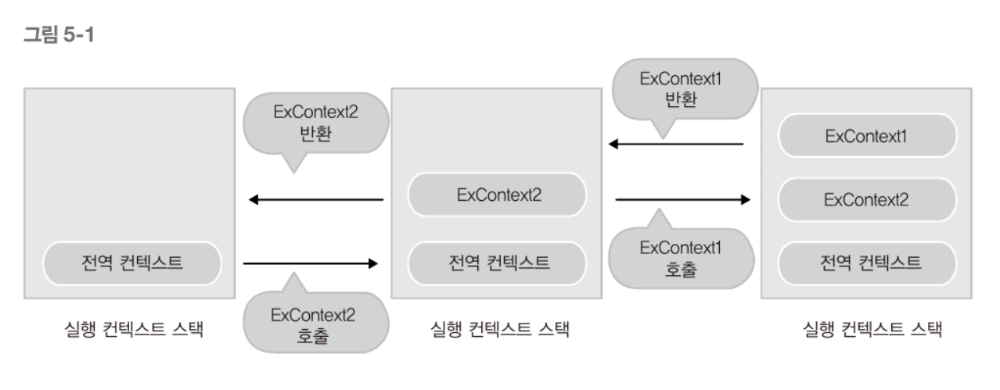
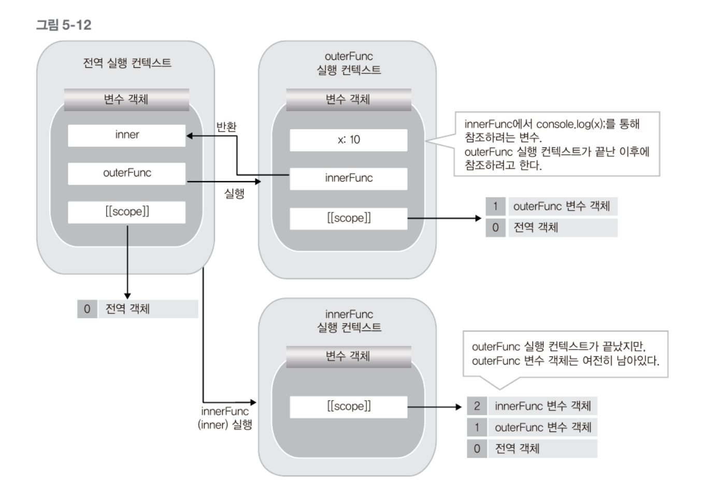

# 실행 컨텍스트와 클로저
살펴볼 내용
1. 실행 컨텍스트(Execution context)
2. 활성객체(Activation Object)와 변수객체(Variable Object)
3. 스코프 체인(Scope Chain)
4. 클로저(closure)

## 1. 실행 컨텍스트 개념
C언어에서 콜 스택에 들어가는 실행 정보와 비슷하다. ECMAScript에서는 실행 컨텍스트를 '실행 가능한 코드를 형상화하고 구분하는 추상적 개념'으로 기술한다.
 이를 앞의 콜 스택과 연관 짓는다면. __실행가능한 자바스크립트 코드 블록이 실행되는 환경__ 이라고 할 수 있다. 여기서 실행가능한 코드블록은 대게 함수가 된다. ECMAScript는 실행 컨텍스트가 형성되는 경우를 __세 가지__ 로 규정하고있다.
1. 전역코드
2. _eval()_ 함수로 실행되는 코드
3. 함수 안의 코드를 실행할 경우

보통의 경우 함수로 실행컨텍스트를 만들고 이 코드 블록 안에 변수 및 객체, 실행가능한 코드가 있다. 이 코드가 실행되면 실행 컨텍스트가 생성되고 실행 컨텍스트는 스택안에 차곡차곡 쌓이고 제일 위에 위치한 실행 컨텍스트가 현재 실행되고있는 컨텍스트이다.
>ECMAScript에서의 실행 컨텍스트 생성 
>현재 실행되는 컨텍스트에서 이 컨텏트와 관련 없는 실행 코드가 실행되면, 새로운 컨텍스트가 생성되어 스택에 들어가고 제어권이 그 컨텍스트로 이동한다.

    function ExContext1(){
        //
    };
    function ExContext2(){
        Excontext1();
    };
    ExContext2();

스택의 구조로 실행된다.

## 2. 실행 컨텍스트 생성 과정
이번 장에 중요한 개념
* 활성객체와 변수객체
* 스코프 체인
---

    function execute(param1, param2){
        var a =1,b=2;
        function func(){
            return a+b;
        }
        return param1+param2+func();
    }
    execute(3, 4);

---
### 2.1. 활성 객체 생성
활성 객체란 컨텍스트 생성시 자바스크립트 엔진은 해당 컨텍스트에서 실행에 필요한 여러 정보를 담을 객체를 생성하는데 그 객체를 말한다. 이 객체에 앞으로 사용할 매개변수, 사용자가 정의한 변수, 객체 등을 저장하고 __새로 만들어진 컨텍스트로 접근이 가능__ 하게 되어있다.

### 2.2. arguments 객체 생성
다음으로는 arguments 객체를 생성한다. 활성 객체는 arguments 프로퍼티로 arguments 객체를 참조한다(활성 객체 안 arguments 프로퍼티).

## 2.3. 스코프 정보 생성
스코프란 현재 컨텍스트의 유효범위를 나타낸다. 이 스코프 정보는 현재 실행중인 컨텍스트 안에서 링크드 리스트와 유사한 형식으로 만들어진다. 특정 변수에 접근해야 할 경우 이 리스트를 사용한다. 이 리스트로 현재 컨택스트 및 상위 컨텍스트의 변수까지 접근이 가능하다. 이 리스트에서 찾지 못한 변수는 정의되지 않은 변수에 접근하는 것으로 판단하고 에러를 발생시킨다. 이 리스트를 __스코프 체인__ 이라고 하는데 \[\[scope\]\]프로퍼티로 참조된다. 
현재 생성된 활성 객체가 스코프 체인의 제일 앞에 추가되고 함수의 인자, 지역변수 등에 접근할 수 있다.

### 2.4. 변수 생성
현재 실행 컨텍스트에서 컨텍스트 내부에서 사용되는 지역 변수의 생성이 이루어진다(활성 객체에 저장, 활성 객체 == 변수 객체).

변수 객체 안에서 호출된 함수 인자는 각각의 프로퍼티가 만들어지고 값이 할당된다(값이 할당되지 않으면 undefined). 

위의 _execute()_ 함수에서 excute(3, 4)가 되기 전까지 함수의 생성과 초기화는 되지 않는다. 

### 2.5. this 바인딩
마지막 단계에서는 _this_ 키워드를 사용하는 값이 할당된다. _this_ 가 참조하는 객체가 없으면 전역 객체를 참조한다.

### 2.6. 코드 실행
앞의 2.1.~2.5. 까지의 과정으로 하나의 실행 컨텍스트 생성, 변수객체 생성 후 코드에 있는 여러가지 표현식이 실행된다. 이렇게 실행되며 변수의 초기화, 연산, 다른 함수의 실행 등이 이루어진다.
> 전역실행 컨텍스트는 일반적인 실행컨텍스트와 다르다. arguments 객체가 없고 전역 객체 하나만을 포함하는 스코프 체인이 있다. 앞서 말한 컨텍스트가 생성되는 세 가지중 전역코드가 실행될 때 전역 실행 컨텍스트가 생성된다. 전역실행 컨텍스트 안의 내부함수는 일반적으로 탑 레벨의 함수이고 변수 객체는 전역 객체이다(따라서 전역적으로 선언된 함수와 객체가 전역 객체의 프로퍼티가 된다).

## 3. 스코프 체인
C의 경우 {}로 묶여있는 범위가 스코프이다. 하지만 자바스크립트에서는 {}블록(for(), if(), ...)은 유효범위가 없다. __오직 함수만이 유효범위의 한 단위이다__. 이 유효 범위를 나타내는 스코프가 \[\[scope\]\]프로퍼티로 각 함수 객체 내에서 링크드 리스트 형식으로 관리되는데 그것을 스코프 체인이라고 한다.
__각각의 함수는 \[\[scope\]\] 프로퍼티로 자신이 생성된 실행 컨텍스트의 스코프 체인을 참조한다__. 함수가 실행되면 실행 컨텍스트가 생성되고, 이 실행 컨텍스트는 실행된 함수의 \[\[scope\]\]프로퍼티를 기반으로 새로운 스코프 체인을 만든다.

### 3.1. 전역 실행 컨텍스트의 스코프 체인
    var var1 = 1;
    var var2 = 2;

현재 전역 실행 컨텍스트 하나만 실행되고 있어 참조할 상위 컨텍스트가 없다. 자신이 최상위 변수 객체이다. 따라서 이 변수 객체의 스코프 체인은 자기 자신만을 가진다.

### 3.2. 함수를 호출한 경우 생성되는 실행 컨텍스트의 스코프 체인
    var var1 = 1;
    var var2 = 2;
    function func() {
        var var1 = 10;
        var var2 = 20;
    }
    func();

위를 실행하면 전역 실행 컨텍스트를 생성하고 func() 함수 객체가 만들어진다. 이 함수 객체의 \[\[scope\]\]는 현재 실행되는 컨텍스트의 변수 객체에 있는 \[\[scope\]\]를 그대로 가진다. 따라서 func 함수객체의 \[\[scope\]\]는 전역 변수 객체가 된다.

그후 func()를 실행하게 되면 함수를 실행하므로 새로운 컨텍스트가 만들어진다(편의상 func 컨텍스트). func 컨텍스트의 스코프 체인은 실행된 함수의 \[\[scope\]\]을 그대로 복사한 후 현재 생성된 변수 객체를 복사한 스코프 체인의 맨 앞에 추가한다. 따라서 func 컨텍스트의 스코프 체인은 \[func 변수 객체 - 전역 객체\]가 된다.

이런식으로 만들어진 스코프 체인으로 식별자 인식이 이루어진다. 식별자 인식이란 스코프 체인의 첫 번째 변수 객체부터 식별자와 대응되는 이름의 프로퍼티가 있는 지 확인하는 것이다. _this_ 는 식별자가 아닌 키워드로 분류되어 스코프 체인의 참조없이 접근할 수 있다.

## 4. 클로저

### 4.1. 클로저의 개념
    function outerFunc(){
        var x = 10;
        var innerFunc = function(){
            //
        };
        return innerFunc;
    }
    var inner = outerFunc();
    inner();
위의 코드의 스코프 체인을 그려본다면

이다.

위 그림을 보면 outerFunc의 실행 컨텍스트는 사라졌지만 innerFunc에서 outerFunc의 변수 객체를 여전히 참조중이다. 이 것이 클로저의 개념이다.
__이미 생명 주기가 끝난 외부 함수의 변수를 참조하는 함수를 클로저라고 한다__.

### 4.2. 클로저의 활용
클로저는 자원과 성능에서 손해를 볼 수 있으므로 무차별 적으로 사용해서는 안된다. 함수형 프로그래밍에서 대게 활용이 가능하다

#### 4.2.1. 특정 함수에 사용자가 정의한 객체의 메소드 연결하기

#### 4.2.2. 함수의 캡슐화

#### 4.2.3. setTimeout()에 지정되는 함수의 사용자 정의

### 4.3. 클로저를 활용할 때 주의사항

1. 클로저의 프로퍼티 값이 쓰기 가능하므로 그 값이 여러 번 호출로 항상 변할 수 있음에 유의해야한다. 
2. 하나의 클로저가 여러 함수 객체의 스코프 체인에 들어가 있는 경우도 있다.
3. 루프 안에서 클로저를 사용할 때는 주의하자