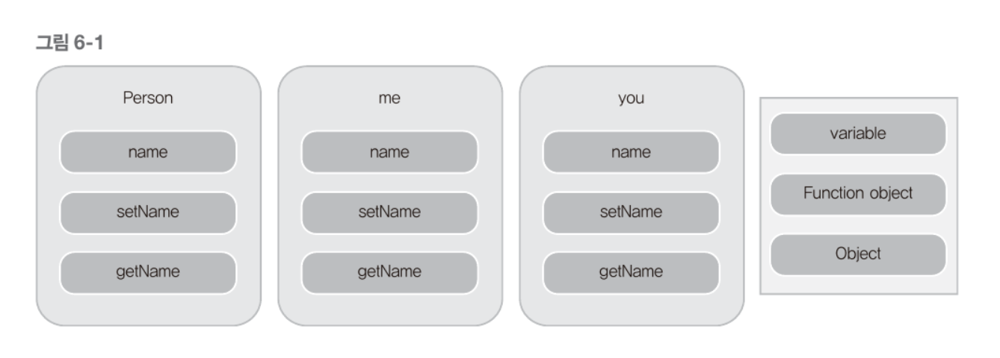
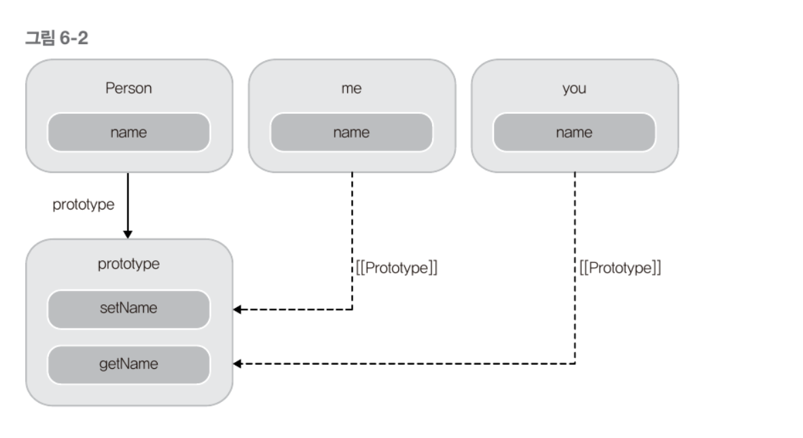
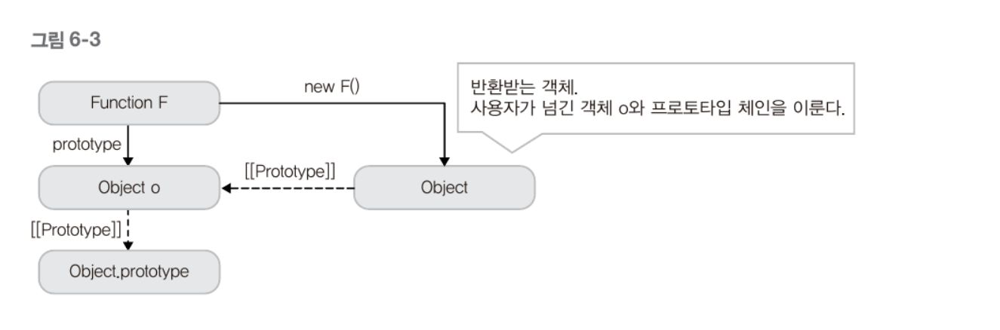
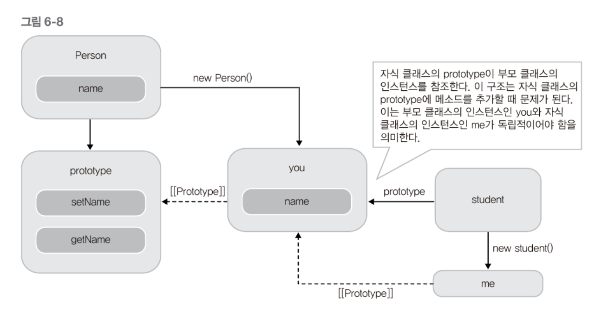
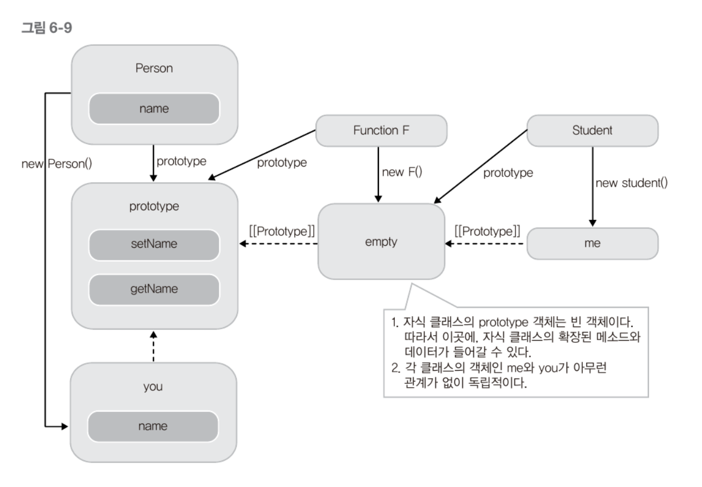

# 객체지향 프로그래밍
객체지향의 3가지(캡상타치)
* 캡슐화
* 상속
* 다형성

이 장에선 클래스, 상속, 캡슐화를 자바스크립트로 구현하는 것을 목표로 한다.

구분|클래스 기반언어 | 프로토타입 기반 언어|
|---|---|---|
|해당 언어| Java, C++, ...| JavaScript
|특성| 모든 인스턴스가 클래스에 정의된 대로 같은 구조이며 런타임에 바꿀 수 없다.| 객체의 자료구조, 메소드를 동적으로 바꿀 수 있다.|
|장점|정확성, 안정성, 예측성측면에서 프로토타입 기반 언어보다 더 나은 결과를 보장한다.|동적으로 자유롭게 객체의 구조와 동작방식을 바꿀 수 있다.|

## 1. 클래스, 생성자, 메소드
C++, Java 등의 언어는 _class_ 라는 키워드로 클래스를 만들 수 있다. 하지만 자바스크립트는 이런 개념이 없고 클래스, 생성자, 메소드를 모두 __함수__ 로 구현한다.

    function Person(arg){
        this.name = arg;

        this.getName = function(){
            return this.name;
        }
        this.setName = function(value){
            this.name = value;
        }
    }

    var me = new Person("zzoon"); // zzoon
    me.setName("iamhjoo"); // iamhjoo

위 함수는 기존 객체지향언어의 클래스의 인스턴스를 생성하는 코드와 매우 유사하지만 여러 인스턴스를 생성하였을 때 같은 함수를 따로 생성하여 메모리를 불필요하게 중복되게 사용한다.

    
    function Person(arg){
        this.name = arg;
    }
    Person.prototype.getName = function(){
        return this.name;
    }
    Person.prototype.setName = function(value){
       this.name = value;
    }

    var me = new Person("me");
    var you = new Person("you");
    

이 처럼 클래스안의 메소드를 정의할때는 프로토타입 객체에 정의 한 후 _new_ 로 생성한 객체에서 접근할 수 있게 하는 것이 좋다.
 
더글라스 크락포드는 다음과 같은 함수를 제시하면서 메소드를 정의하는 방법을 소개한다.

---
    Function.prototype.method = function(name, func){
        if(!this.prototype[name]){
            this.prototype[name] = func;
        }
    }
---

이전의 것을 위와 같은 형태로 바꾸면 

    Function.prototype.method = function(name, func){
        this.prototype[name] = func;
    }

    function Person(arg){
        this.name = arg;
    }
    Person.method("setName", function(value){
        this.name = value;
    }); // Person이라는 함수도 Function의 하위 객체이기 때문에 method라는 프로퍼티를 가지고 있다. ***

## 2. 상속
자바스크립트는 클래스 기반의 상속을 지원하지 않는다. 하지만 프로토타입 체이닝으로 상속을 구현할 수 있다(객체 리터럴을 중심으로 상속 구현). 상속에는 두 가지 방식이 있다.
* 프로토 타입을 이용한 상속
* 클래스기반의 상속

### 2.1. 프로토타입을 이용한 상속

    function create_object(o){
        function F(){}
        F.prototype = o;
        return new F();
    }

위 함수는 o라는 인자를 받아 F.prototype 프로퍼티에 인자로 들어온 o라는 객체를 참조하고 F를 생성자로하는 새로운 객체를 반환한다(부모객체 : o, 자식객체를 리턴).
 
위의 create_object()함수는 ECMAScript 5에서 Object.create()함수로 제공된다.

자식은 부모의 메소드를 재정의 하거나 추가의 기능을 더 사용할 수 있어야 한다.

___extend()___

    function extend(obj, prop){
        if(!prop){ prop = obj; obj = this }
        for(var i in prop) obj[i] = prop[i];
        return obj;
    }
extend()의 기능만 구현한 얕은 복사이다. 

    var student = create_object(person);
    var added = {
        setAge = function(age){
            this.age = age;
        }
        getAge = function(){
            return this.age;
        }
    }

    extend(student, added);

### 2.2. 클래스 기반의 상속
프로토타입을 이용한 상속에서는 객체 리터럴로 생성된 객체의 상속이었지만 여기서는 클래스의 역할을 하는 하는 함수로 상속을 구현한다.

    function Student(arg){
        Person.apply(this, arguments);
    }

    var you = new Person("iamhjoo");
    Student.prototype = you;

    var me = new Student("zzoon");
    me.setName("zzoon");

위 코드의 두 클래스의 프로토타입 사이에 중개자를 만들어 보자

    function Person(arg){
        this.name = arg;
    }
    Function.prototype.method = function (name, func){
        this.prototype[name] = func;
    }
    Person.method = func ("setName", function (value){
        this.name = value;
    });
    Person.method = func ("getName", function (){
        return this.name;
    });

    function Student(arg){}

    function F(){};
    F.prototype = Person.prototype;
    Student.prototype = new F();
    Student.prototype.constructor = Student;
    Student.super = Person.prototype;

    var me = new Student();
    me.setName("zzoon");

위 상황을 그림으로 나타내면 아래와 같다

