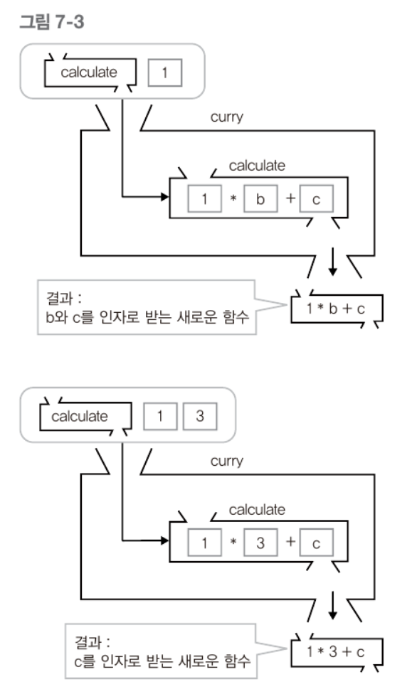

# 함수형 프로그래밍

함수형 프로그래밍 언어 : Lisp, Haskell, ...

## 1. 함수형 프로그래밍의 개념
함수형 프로그래밍이란 함수의 조합으로 작업을 수행하는 것을 의미한다. 중요한 점은 작업이 이루어지는 동안 작업에 필요한 데이터와 상태는 변하지 않는다는데 있다.

특정 문자열을 암호화하는 함수가 여러개 있다고 해보자(pseudo code)

    f1 = encrypt1;
    f2 = encrypt2;
    f3 = encrypt3; 
    // f1,f2,f3은 입력값이 정해지지않고 서로 다른 암호화 코드이다.
    pure_value = 'zzoon'; // 암호와할 문자열
    encrypt_value = get_encrypted(x); // get_encrypted(x)는 암호화할 함수를 받아 암호화 후 반환한다. ex) encrypted_value = get_encrypted(f1);

pure_value는 작업에 필요한 데이터이고 작업이 수행되는동안 변하지 않는다. 변할 수 있는 것은 입력으로 들어오는 함수뿐이다(f1, f2, f3). 
f1, f2, f3는 외부에 아무런 영향을 미치지 않는다 이를 __순수 함수__ 라고 한다. 
get_encrypted()함수는 인자로서 f1, f2, f3함수를 받는다. 위 코드는 결과가 encrypted_value라는 값이지만 결과는 함수로 반환될 수도 있다. 이렇게 함수를 또 하나의 값으로 간주하여 함수의 인자 또는 반환값으로 사용할 수 있는 함수를 __고계 함수__ 라고 한다.

위 예제와 같이 데이터는 그대로 둔 채로 제어 가능한 함수를 변경, 조합함으로써 원하는 결과를 얻어내는 것이 함수형 프로그래밍의 중요한 특성이다.

## 2. 자바스크립트에서의 함수형 프로그래밍

* 일급 객체로서의 함수
* 클로저

위의 두 가지를 자바스크립트가 지원하기 때문에 함수형 프로그래밍이 가능하다.

    var f1 = function (input) {
        var result
        // ...
        return result
    }
    // ... f2, f3

    var get_encrypted = function (func) {
        var str = 'zzoon';

        return function (){
            return func.call(null, str);
        }
    }

자바스크립트에서는 함수를 인자로 받고 함수를 반환하는 것이 가능하기 때문에 이러한 함수형 프로그래밍이 가능하다. 

__함수형 프로그래밍으로 수학적 문제 해결__

### 2.1. 배열의 각 원소 총합 구하기

    function sum(arr){
        var len = arr.length;
        var i = 0, sum = 0;
        for (; i <len ; i++ ){
            sum += arr[i];
        }
        return sum;
    }

    function multiply(arr){
        var len = arr.length;
        var i = 0, multiply = 1;
        for (; i <len ; i++ ){
            multiply *= arr[i];
        }
        return multiply;
    }

위는 명령형 프로그래밍 방식으로 작성된 코드이다. 문제 하나하나를 각각의 함수를 구현하여 문제를 풀고 있다.

    function reduce(func, arr, memo){
        var len = arr.length, i = 0 , accum = memo; // memo는 초기값

        for(;i<len ; i++){
            accum = func(accum, arr[i]);
        }

        return accum;
    }

    var sum = function(x, y){
        return x+y;
    };

    var multiply = function (x, y){
        return x*y;
    }

    reduce(sum, arr, 0);

이렇게 함수형 프로그래밍은 기존보다 더 높은 단계의 모듈화를 이룰 수 있다.

## 3. 자바스크립트에서의 함수형 프로그래밍을 활용한 주요 함수

### 3.1. 함수 적용
Function.prototype.apply 함수로 함수를 호출할 수 있다. call과 apply는 같다. apply는 함수형 프로그래밍에서 사용되는 용어이다. 함수형 프로그래밍은 특정 데이터를 여러가지 함수에 적용시키는 방식으로 작업을 수행한다. 

### 3.2. 커링
커링이란 특정 함수에서 정의된 인자의 일부를 넣어 고정시키고 나머지를 인자로 받는 새로운 함수를 만드는 것을 의미한다.

    function calculate(a, b, c){
        return a+b+c;
    }

    function curry(func){
        var args = Array.prototype.slice.call(arguments, 1);
        
        return function (){
            return func.apply(null, args.concat(Array.prototype.slice.call(arguments)));
        }
    }

    var new_func1 = curry(calculate, 1); // 5 (1*2+3 = 5)
    var new_func2 = curry(calculate, 1, 3); 6 (1*3+3)

