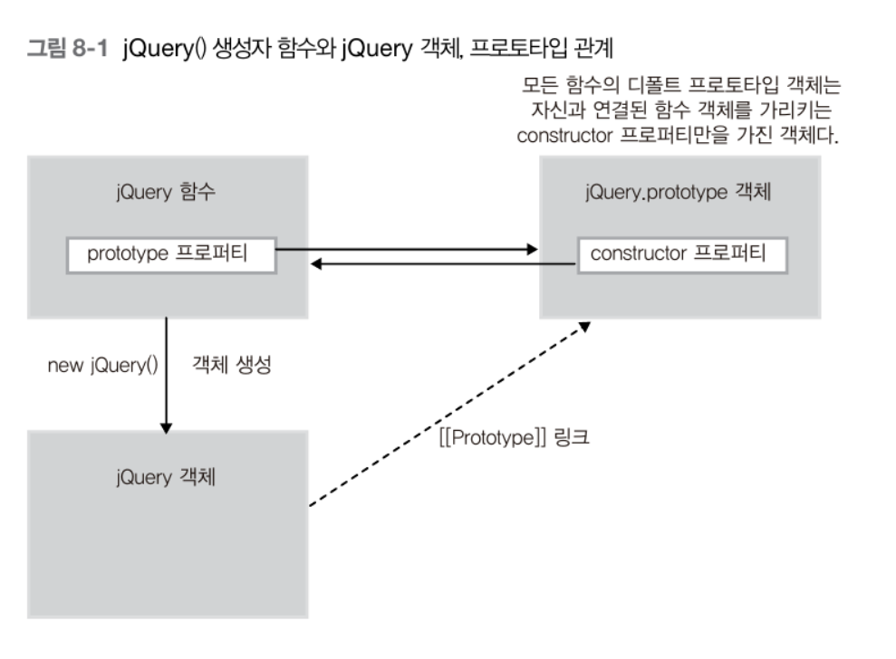
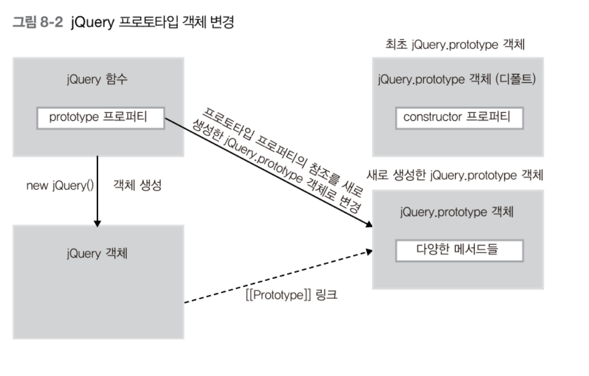
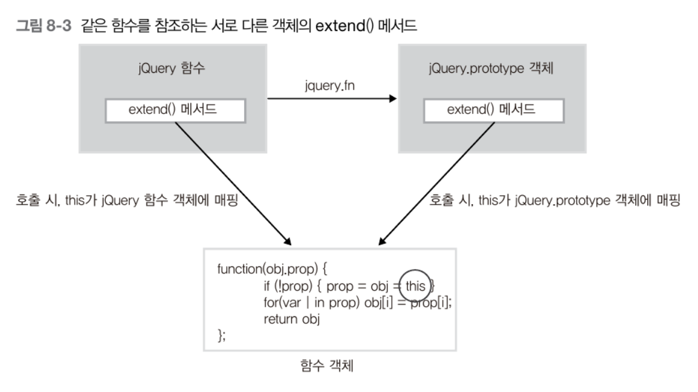
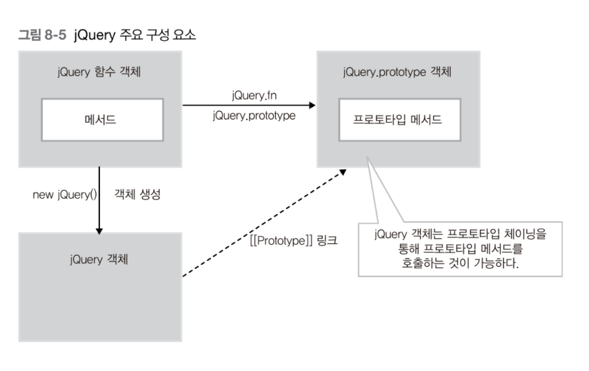
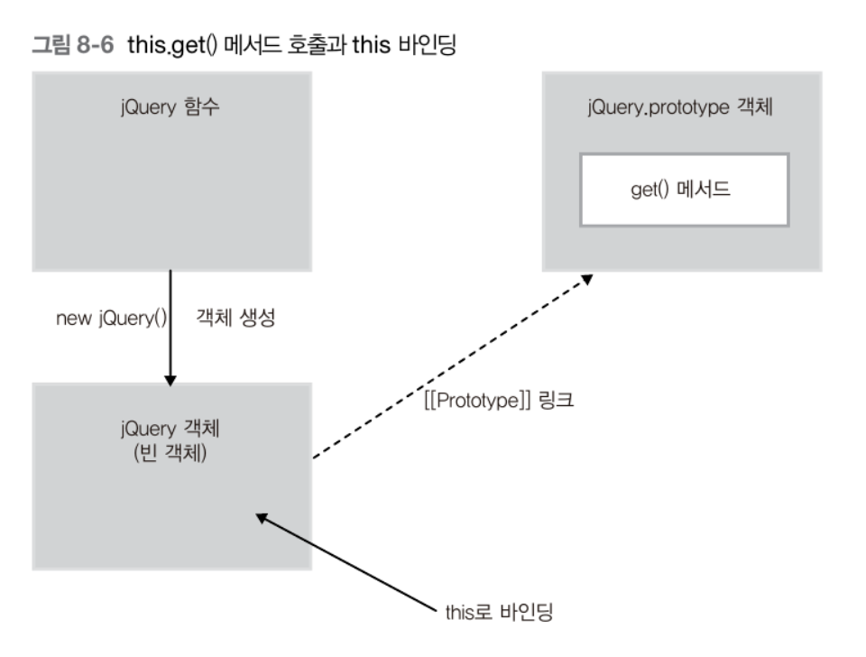

# jQuery 소스코드 분석

jQuery는 웹을 개발할 때 필요한 DOM파싱, 이벤트 처리, Ajax 같은 기능을 아주 쉽게 작성할 수 있게 도와주는 라이브러리다.

## 1. jQuery 1.0 소스 코드 구조
jQuery 소스코드의 전체 구조를 먼저 파악해 보자

### 1.1. jQuery 함수 객체
jQuery 라이브러리는 다음 예제와 같이 jQuery() 함수의 정의부터 시작한다. 이 함수는 여러가지 기능을 하는데 _new_ 연산자를 이용해 jQuery 객체를 생성하는 기능이다.

    function jQuery(a, c){
        // Shortcut for document ready (because $(document).each() is silly)
        if (a && a.constructor == Function && jQuery.fn.ready )
            return jQuery(document).ready(a);
        
        // Make sure that a selection was provided
        a = a || jQuery.context || document;

        // Watch for when a jQuery object is passed as the selector
        if (a.jquery)
            return $( jQuery.merge(a, []));
        
        // Watch for when a jQuery object is passed at the context
        if ( c && c.jquery )
            return $( c ).find(a);

        // If the context is global, return a new object 
        if (window == this )
            return new jQuery(a, c);

        // Handle HTML strings
        var m = /^[^<]*(<.+>)[^>]*$/.exec(a);
        if ( m ) a = jQuery.clean( [ m[1] ] );

        // Watch gor when an array is passed in
        this.get( a.constructor == Array || a.length && !a.nodeType && a[0] != undefined && a[0].nodeType ? 
            // Assume that it is an array of DOM Elements
            jQuery.merge(a, []) :

            // Find ths matching elements and save them for later
            jQuery.find(a, c)
        );

        // See if an extra function was provided
        var fn = arguments[ arguments.length - 1];

        // If so, execute it in context
        if ( fn && fn.constructor == Function )
            this.each(fn);
    }

### 1.2. 변수 $를 jQuery() 함수로 매핑
일반적으로 개발자들이 jQuery를 사용할 때 jQuery() 함수를 호출하기보다 $()와 같은 형태로 jQuery의 기능을 호출하는 것이 대부분이다. 이 것은 jQuery함수를 $변수에 매핑시켰기 때문이다.

    var $ = jQuery;

### 1.3. jQuery.prototype 객체 변경
모든 함수객체는 prototype 프로퍼티가 있다. prototype 프로퍼티가 가리키는 프로토타입 객체는 함수가 생성자로 동작할 때 이를 통해 새로 생성된 객체의 부모 역할을 한다. 따라서 다음과 같은 관계가 성립한다.

new 연산자로 jQuery() 생성자 함수를 호출할 경우 생성된 jQuery객체는 [[Prototype]]링크로 자신의 프로토 타입인 jQuery.prototype 객체에 접근이 가능하다. 때문에 모든 jQuery 객체 인스턴스는 자신의 프로토 타입인 jQuery.prototype 객체의 프로퍼티를 공유할 수 있다.

jQuery() 함수 정의 후 jQuery.prototype 디폴트 객체를 객체 리터럴 형식의 다른 객체로 변셩하고 이 변경된 jQuery의 프로토타입을 jQuery.fn 프로퍼티가 참조하게 한다. 이렇게 하면 변경된 프로토타입 객체에 정의된 메소드를 사용할 수 있다.

    jQuery.fn = jQuery.prototype = {
        jquery : "$Rev$",
        size : function (){
            return this.length;
        },
        ...
    }

이렇게 변경하면 다음과 같은 그림의 관계가 된다.

### 1.4. 객체 확장 - extend()메소드
jQuery 소스코드에서는 __extend()__ 메소드를 제공한다.

다음 코드는 _jQuery.extend()_ 와 _jQuery.fn.extend()_ 에 관한 것이다.

    jQuery.extend = jQuery.fn.extend = function(obj, prop) {
        if (!prop) { prop = obj; obj = this }
        for (var i in prop ) obj[i] = prop[i];
        return obj;
    }
_jQuery.extend()_ 와 _jQuery.fn.extend()_ 는 같은 함수를 참조한다.

첫 번째 인자 obj 객체에 두 번째 인자 prop객체의 모든 프로퍼티를 추가한다.

jQuery.extend() 호출로 jQuery 함수 객체의 기능을 확장하고 jQuery.fn.extend() 호출로 jQuery.prototype 객체의 기능을 확장한다.

### 1.5. jQuery 소스코드의 기본 구성 요소
jQuery 소스코드는 세 부분으로 구분된다.
* jQuery 함수객체
* jQuery.prototype 객체
* jQuery 객체 인스턴스

jQuery() 함수의 가장 기본적인 역할은 new 연산자로 jQuery 객체를 생성하는 것이다. 이렇게 생성된 jQuery 객체는 프로토타입 체이닝으로 jQuery.prototype 객체에 포함된 프로토타입 메소드를 호출할 수 있다. 

jQuery 함수 객체는 메소드를 포함한다. 이 메소드는 jQuery 인스턴스 객체에 특화되지 않고 범용적으로 사용되는 jQuery 코어 메소드로 구성된다.

## 2. jQuery의 id 셀렉터 동작 분석
jQuery의 가장 기본적인 기능은 HTML 문서에서 원하는 DOM객체를 선택한 후, 해당 객체의 속성을 변경하거나 효과, 이벤트등을 처리하는 것이다.

    <!DOCTYPE html>
    <html lang="en">
    <head>
        
    </head>
    <body>
        
Hello

        
    </body>
    </html>
이런식으로 id 셀렉터를 사용한다.

### 2.1. $("#myDiv") 살펴보기
$는 jQuery 함수를 참조하기 때문에 _$("#myDiv")_ 는 _jQuery("#myDiv")_ 를 의미한다. jQuery함수에서 첫 번째 인자 a 에는 문자열 "#myDiv", 두 번째 인자 c에는 undefined가 전달된다.

    function jQuery(a, c){
        ...

        // this 값을 살펴서 현재 jQuery()가 함수 혀애로 호출됐는지를 체크한다.
        if ( window == this)
            return new jQuery(a, c);
            // this가 전역객체 window로 바인딩 되는 경우는 jQuery를 함수형태로 호출하는 경우이다. 예제에서 $("#myDiv")는 함수 호출 형태이므로 this는 전역객체인 window에 바인딩된다. 따라서 new 연산자와 함께 생성자 함수형태로 다시 호출된다. 
            // 다시 호출된 함수는 함수 호출 패턴에 따라 새로 생성되는 빈 객체에 바인딩 되므로 window가 아니다. 따라서 if문을 실행하지 않고 넘어간다.

        ...   

        this.get (a.constructor == Array || a.length && !a.nodeType && a[0] != undefined && a[0].nodeType ?
            // Assume that it is an array of DOM Elements
            jQuery.merge(a, []) :

            // Find the matching elements and save them for later
            jQuery.find(a, c)
        );     
        /*
        1. a.constructor == Array --> false : '#myDiv'는 문자열 이므로 a.constructor는 문자열이다.

        2. a.length --> true : 문자열이므로 length프로퍼티가 있다. 값은 6

        3. !a.nodeType --> true : a는 문자열이므로 nodeType프로퍼티가 없다. 따라서 undefined값을 가진다 때문에 !a.nodeType은 true값을 가진다. (nodeType은 DOM객체가 가지는 프로퍼티)

        4. a[0] != undefined --> true : a[0]는 '#' 이다. 따라서 true이다.

        5. a[0].nodeType --> false : 문자열은 DOM객체가 아니다.

        종합 : false --> jQuery.find(a, c) 실행 
        */
    }

> regexp.exec(string) 메소드 
>정규표현식 객체의 exec(string)메소드는 인자로 받은 string이 자신의 정규표현식에 일치하는 지 체크하고 일치할 경우 배열을 반환한다(일치하지 않을 경우 null반환).

>정규표현식 
>정규 표현식(正規表現式, 영어: regular expression, 간단히 regexp 또는 regex, rational expression) 또는 정규식(正規式)은 특정한 규칙을 가진 문자열의 집합을 표현하는 데 사용하는 형식 언어이다.

#### 2.1.1. jQuery.find(a, c)살펴보기
_jQuery.find()_ 는 jQuery함수객체 내에 포함된 메소드로서 jQuery의 셀렉터 기능을 처리하는 중요 함수이다.

    find : function (t , context){
        // Make sure that the context is a DOM Element
        if (context && context.nodeType == undefined )
            context = null;
        /*
        c가 undefined이기 때문에 if문 이하는 실행되지 않는다.
        */

        // Set the correct context (if none is provided)
        context = context || jQuery.context || document;
        /*
        context인자의 기본값을 할당한다. context가 undefined면 jQuery.context확인하고 또 undefined면 document를 할당한다.
        */

        if (t.constructor != String ) return [t];
        /*
        t는 String이다. 따라서 false
        */

        if( !t.indexOf("//")){
            context = context.documentElement;
            t = t.substr(2, t.length);
        } else if (!t.indexOf("/")) {
            context = context.documentElement;
            t = t.substr(1, t.length);
            // FIX Assume the root element is right :(
            if(t.indexOf("/") >= 1)
                t == t.substr(t.indexOf("/"),t.length);
        }
        /*
        t는 '//' or '/'를 포함지 않기 때문에 indexOf('/')등이 -1 이 반환된다(-1은 true취급이기 때문에 !t.indexOf() 이하가 모두 실행되지 않는다.).
        */

        var ret = [context];
        var done = [];
        var last = null;

        while (t.length >0 && last != t){
            var r = [];
            last = t;

            t = jQuery.trim(t).replace( /^\/\//i, "");
            /*
            '/^\/\//i' 이 정규표현식은 문자열이 '//'로 시작하는 지 검사한다. 따라서 t는 //가 있거나 공백이 양끝에 있다면 없어진다.
            */

            var foundToken = false;

            for (var i = 0 ; jQuery.token.length ; i += 2){
                if (foundToken) continue;

                var re = new RegExp("^(" + jQuery.token[i] + ")"); // RegExp() 정규표현식 생성함수
                var m = re.exec(t);

                if ( m ) {
                    r = ret = jQuery.map(ret, jQuery.token[i+1]);
                    t = jQuery.trim(t.replace(re, ""));
                    
                    foundToken = true;
                }
            }
            /*
            뭔말인지 해석불가
            */
            
            if ( !foundToken ){
                if (!t.indexOf(",") || !t.indexOf("|")){
                    if(ret[0] == context ) ret.shift();
                    done = jQuery.merge( done, ret);
                    r = ret = [context];
                    t = " " + t.substr(1, t.length);
                } else {
                    var re2 = /^([#.]?)([a-z0-9\\*_-]*)/i;
                    var m = re2.exec(t);
                    /*
                    결과 :
                    m[0] = '#myDiv'
                    m[1] = '#'
                    m[2] = 'myDiv'
                    */

                    if (m[1] == "#" ){
                        // Ummm, should make this work in all XML docs
                        var oid = document.getElementById(m[2]);
                        r = ret = oid ? [oid] : [];
                        t = t.replace(re2, "");
                    } else {
                        if( !m[2] || m[1] == "." ) m[2] = "*";

                        for (var i = 0 ; i < ret.length; i++)
                            r = jQuery.merge( r, m[2] == "*" ?
                                jQuery.getAll(ret[i]) :
                                ret[i].getElementByTagName(m[2]));
                    }
                }
            }

            if (t) {
                var val = jQuery.filter(t , r);
                ret = r = val.r;
                t = jQuery.trim(val.t);
            }
        }

        if (ret && ret[0] == context ) ret.shift();
        done = jQuery.merge(done, ret);

        return done;
    }, ...
    
    쥰내게 길어서 분석 엄두가 안남

>string.indexOf(searchString) 
>호출한 문자열에서 searchString인자를 검색하고 일치하는 문자열의 첫 번째 인덱스를 반환한다. 
>jQuery.merge(first, second) 
>first와 second배열의 인자를 합친다. 단 중복된 원소는 합쳐지지 않는다(first에 이미 있는 원소가 second에있으면 합쳐지지 않음). 
>$.merge([0,1,2], [2,3,4])
>--> [0,1,2,3,4]

#### 2.1.2. this.get() 메소드 살펴보기
jQuery.find() 메소드의 호출 결과가 this.get() 메소드를 호출할 때 인자로 사용된다.

this는 new 키워드로 생긴 새로생긴 jQuery객체에 바인딩 된다. new로 생성하여 아무 프로퍼티나 메소드가 없는 빈 객체이지만 jQuery.prototype 객체를 자신의 [[Prototype]]링크로 연결하고 있기 때문에 프로토타입 체이닝으로 this.get 메소드가 실행된다(jQuery.prototype.get()).

    get : function (num){
        if (num && num.constructor == Array ){
            this.length = 0;
            [].push.apply(this, num);

            return this;
        }else{
            ...
        }
    },

this.get()메소드가 호출될 때 num인자로 앞 절에서 살펴본 jQuery.find() 메소드에서 반환된 'myDiv'를 id로 가지는 DOM 객체가 들어있는 배열이 전달된다.

